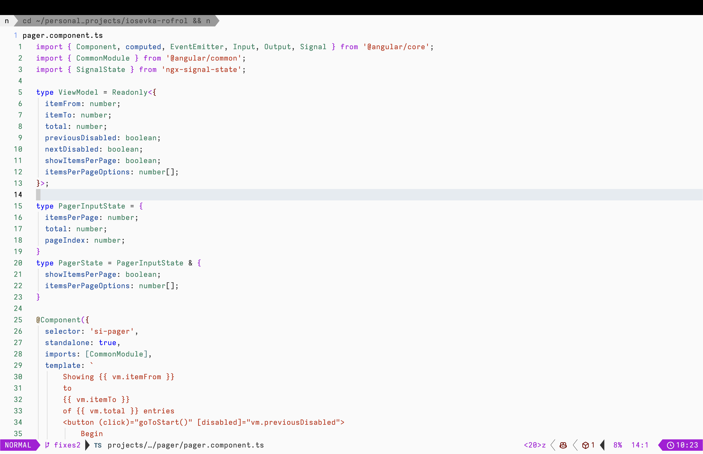

# Iosevka Rofrol

My custom Iosevka font.

- Shapes and width similar to [Zed Mono](https://github.com/zed-industries/zed-fonts).
- No ligatures, no italics, no bold.
- No need to patch with Nerd Fonts. Just install Symbols Nerd Font Mono from the [Nerd Fonts releases page](https://github.com/ryanoasis/nerd-fonts/releases). [More info](https://sw.kovidgoyal.net/kitty/faq/#kitty-is-not-able-to-use-my-favorite-font)

> The variant Iosevka Term is designed to better support terminals and the variant Iosevka Fixed omits the ligatures. <https://en.wikipedia.org/wiki/Iosevka>



## Run

```shell
brew install ttfautohint
mkdir -p vendor && cd vendor
git clone --depth 1 https://github.com/be5invis/Iosevka.git
cd Iosevka
npm install
cd ..
./reinstall.sh
```

## Customize

Import `private-build-plans.toml` from this repository at <https://typeof.net/Iosevka/customizer>

- Overview of stylistic sets <https://github.com/be5invis/Iosevka/blob/main/doc/stylistic-sets.md>
  - <https://news.ycombinator.com/item?id=36785409>
  - <https://github.com/aaronmbos/monocode/blob/main/src/private-build-plans.toml>
  - <https://github.com/shytikov/pragmasevka/blob/main/private-build-plans.toml>
  - <https://git.sr.ht/~ashton314/iosevka-output/tree/main/item/private-build-plans.toml>

## Links

- <https://lambdaland.org/posts/2022-08-01_a_new_font/>
- <https://protesilaos.com/emacs/iosevka-comfy-pictures>
- <https://kau.sh/blog/build-iosevka-font-mac-os/>
- <https://github.com/NNBnh/dotfiles/wiki/font>
